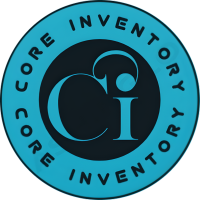

<h1>Proyecto Core Inventory 📍</h1>
<h3>
  Core Inventory es un sistema de información web diseñado para facilitar la gestión de ventas en línea. Con esta plataforma, podrás implementar un sitio web de ventas en línea eficiente y sencillo de utilizar.
  Nuestro sistema te permitirá realizar y gestionar pedidos en línea de forma segura y fácil, lo que te permitirá aumentar tus ventas y la satisfacción de tus clientes. Además, podrás controlar tu inventario de forma precisa, lo que te permitirá evitar pérdidas y asegurar que siempre tengas los productos que necesitas.
</h3>

## Características destacadas ✅

- Realiza pedidos en línea de forma rápida y sencilla 🛒
- Registra tus ventas y lleva un control de tus ingresos 📈
- Administra y controla el inventario de tu negocio en tiempo real 📦
- Personaliza los permisos y funciones de los usuarios con el rol de administrador 👔
- Exporta tus datos y estadísticas para un análisis detallado de tu negocio 📂
- Visualiza gráficos estadísticos claros y precisos para tomar mejores decisiones 📊
- Crea y administra códigos de descuento para fidelizar a tus clientes 🏷️

¡Y aún hay muchas más herramientas y funcionalidades disponibles ⚙️ para hacer crecer tu negocio!
